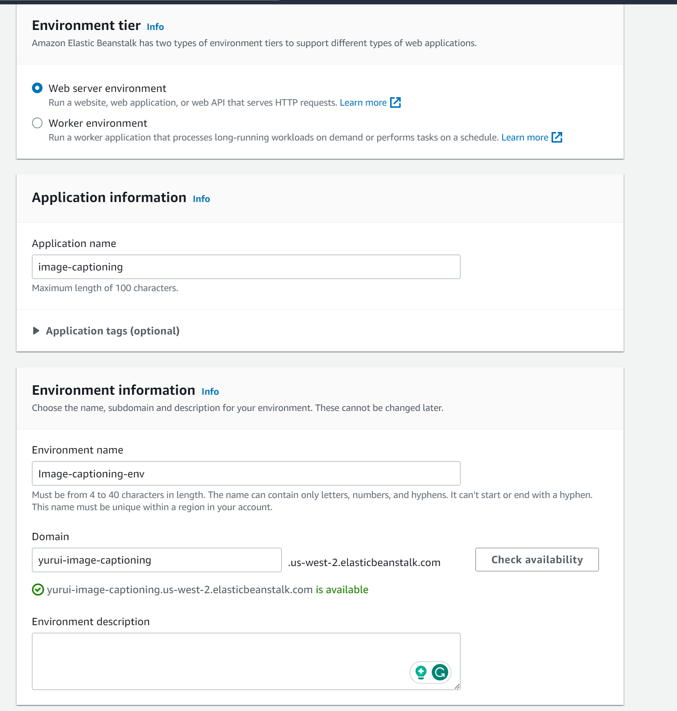
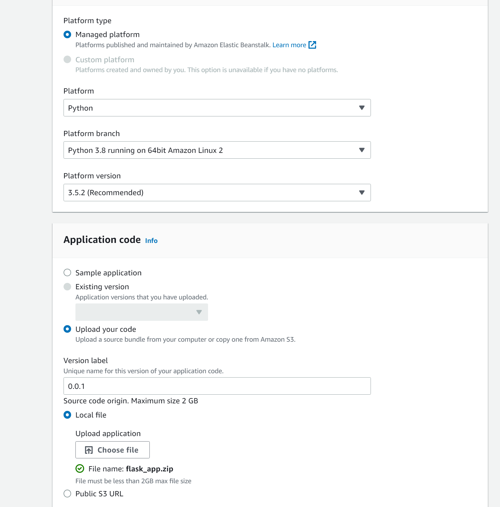
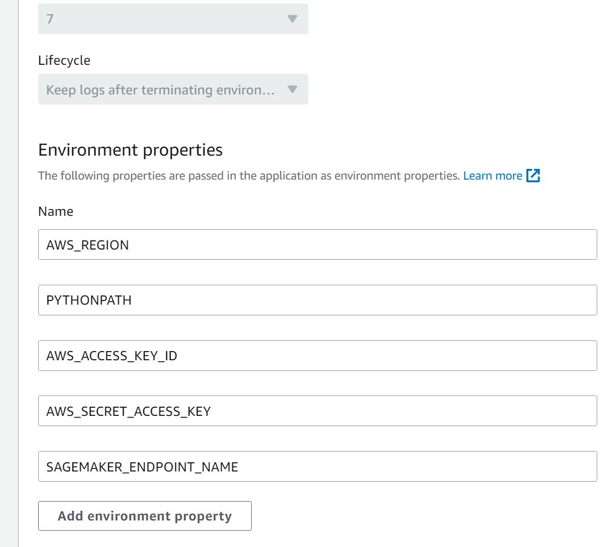

(under construction)

[](https://opensource.org/licenses/MIT)
# Image Captioning Sagemaker App
Deploy Huggingface Image-to-text pretrained model on AWS Sagemaker
1. On mac: `brew install git-lfs`
    
    Do this:
    
    
    [https://huggingface.co/docs/sagemaker/inference](https://huggingface.co/docs/sagemaker/inference)
    


1. After cloning the repo, before creating the tar.gz model file,
    
    Add a folder called `code`
    
    Add inference.py and requirements.txt
    
2. install AWSCLI
    
    `aws configure` with user credentials
    
    Upload to s3:
    
    `aws s3 cp model.tar.gz s3://image-captioning-yurui`
    

1. follow the notebook on sagemaker to deploy the model
    
    Alternatively, load the deployed model using: 
    
    ```python
    from sagemaker import Session
    from sagemaker.predictor import Predictor
    from sagemaker.huggingface.model import HuggingFacePredictor
    
    sagemaker_session = Session()
    predictor = HuggingFacePredictor(
        endpoint_name="<endpoint-name>",
        sagemaker_session=sagemaker_session
    )
    ```
    
2. create flask app scripts `app.py` and `html.index`
    
    run flask the app locally: [`http://127.0.0.1:5000`](http://127.0.0.1:5000/)
    


3. Deploy the app on elastic beanstalk


```python
my_flask_app/
├── application.py
├── requirements.txt
├── templates/
│   └── index.html
└── .ebextensions/
    └── 01_python.config
```

1. Create a **`requirements.txt`** file in your project directory, listing all the necessary Python packages. Your **`requirements.txt`** file should look like this: 

```python
Flask
Pillow
requests
boto3
sagemaker
```

1. . Rename your **`app.py`** to **`application.py`** because Elastic Beanstalk looks for a file named **`application.py`** by default.
2.  Create a **`.ebextensions`** directory in your project directory to store Elastic Beanstalk configuration files. Inside this directory, create a file named **`01_flask.config`** with the following contents:

```python
option_settings:
  aws:elasticbeanstalk:application:environment:
    PYTHONPATH: "/var/app/current:$PYTHONPATH"
  aws:elasticbeanstalk:container:python:
    WSGIPath: "application:application"
```

This file tells Elastic Beanstalk to look for **`application.py`** as the entry point for your Flask app.

4. Create a ZIP archive of your application files: Select all the files and folders in your project directory (**`application.py`**, **`requirements.txt`**, **`.ebextensions`**, and your **`templates`** folder), and create a ZIP archive. Make sure the files are at the root level of the archive, not within a subfolder.

1. head to AWS management console and select Elastic BeanStalk

Add sagemaker full access to **aws-elasticbeanstalk-ec2-role**

use default VPC






8.


