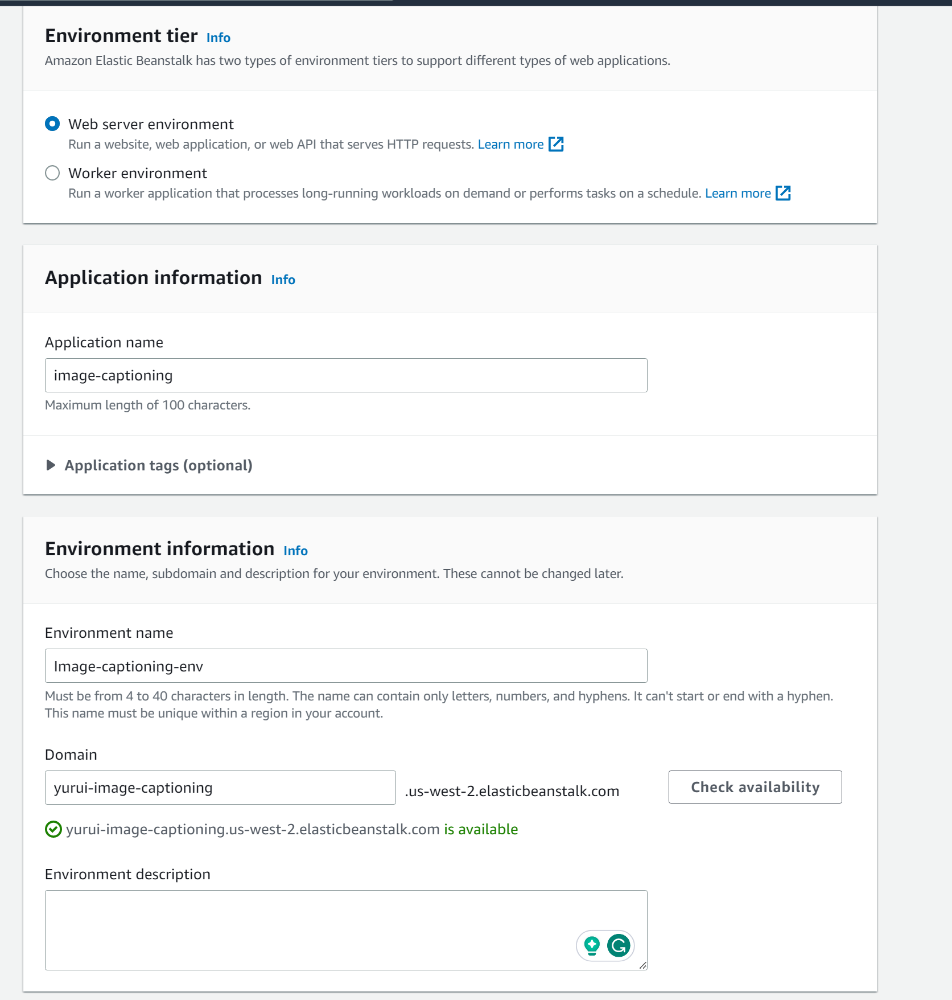

(under construction)

[](https://opensource.org/licenses/MIT)
# Image Captioning Sagemaker App
Deploy Huggingface Image-to-text pretrained model on AWS Sagemaker.

First, we need prepraed a custom `inference.py` script before deploying the model to SageMaker. Since we want our web application to be able to handle both image url or user uploaded image, we need to process the inputs differently based on the type input. SageMaker is expecting a single `model.tar.gz` file uploaded to a S3 bucket with the following layout:
my_flask_app/
├── pytorch_model.bin
├── config.json
├── code/
│   └── requirements.txt
│   └── inference.py
└── .ebextensions/
1. On mac: `brew install git-lfs`
    
    Do this:
    
    
    [https://huggingface.co/docs/sagemaker/inference](https://huggingface.co/docs/sagemaker/inference)
    


1. After cloning the repo, before creating the tar.gz model file,
    
    Add a folder called `code`
    
    Add inference.py and requirements.txt
    
2. install AWSCLI
    
    `aws configure` with user credentials
    
    Upload to s3:
    
    `aws s3 cp model.tar.gz s3://image-captioning-yurui`
    

1. follow the notebook on sagemaker to deploy the model
    
    Alternatively, load the deployed model using: 
    
    ```python
    from sagemaker import Session
    from sagemaker.predictor import Predictor
    from sagemaker.huggingface.model import HuggingFacePredictor
    
    sagemaker_session = Session()
    predictor = HuggingFacePredictor(
        endpoint_name="<endpoint-name>",
        sagemaker_session=sagemaker_session
    )
    ```
    
2. create flask app scripts `app.py` and `html.index`
    
    run flask the app locally: [`http://127.0.0.1:5000`](http://127.0.0.1:5000/)
    


3. Deploy the app on elastic beanstalk


```python
my_flask_app/
├── application.py
├── requirements.txt
├── templates/
│   └── index.html
└── .ebextensions/
    └── 01_flask.config
```

1. Create a **`requirements.txt`** file in your project directory, listing all the necessary Python packages. Your **`requirements.txt`** file should look like this: 

```python
Flask
Pillow
requests
boto3
sagemaker
```

1. . Rename your **`app.py`** to **`application.py`** because Elastic Beanstalk looks for a file named **`application.py`** by default.
2.  Create a **`.ebextensions`** directory in your project directory to store Elastic Beanstalk configuration files. Inside this directory, create a file named **`01_flask.config`** with the following contents:

```python
option_settings:
  aws:elasticbeanstalk:application:environment:
    PYTHONPATH: "/var/app/current:$PYTHONPATH"
  aws:elasticbeanstalk:container:python:
    WSGIPath: "application:application"
```

This file tells Elastic Beanstalk to look for **`application.py`** as the entry point for your Flask app.

4. Create a ZIP archive of your application files: Select all the files and folders in your project directory (**`application.py`**, **`requirements.txt`**, **`.ebextensions`**, and your **`templates`** folder), and create a ZIP archive. Make sure the files are at the root level of the archive, not within a subfolder.

1. head to AWS management console and select Elastic BeanStalk

Add sagemaker full access to **aws-elasticbeanstalk-ec2-role**

use default VPC




8.


